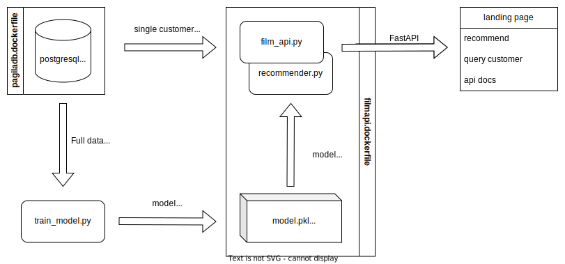

# Film rental recommender system

This repository implements a recommender system microservice on top of an example database of film rentals. The recommender is accessible as an API via the browser.

The recommender is a relatively basic collaborative filtering method based on [latent semantic analysis](https://en.wikipedia.org/wiki/Latent_semantic_analysis) - a truncated singular value decomposition of a TFiDF transformed customer-rental matrix.

## Tech stack:
- 🐘 [PostgreSQL](https://www.postgresql.org/), with example database from [xzilla/pagila](https://github.com/xzilla/pagila); see also [the schema](https://zwbetz-gh.github.io/schemaspy-postgres-github-pages/tables/film.html)
- 🐻 [polars](https://www.pola.rs/) for running queries and dataframe operations
- 📈 [scikit-learn](https://scikit-learn.org/) for creating a simple product recommender
- ⚡ [FastAPI](https://fastapi.tiangolo.com/) for turning this into a microservice
- 🐋 [Docker](https://www.docker.com/) for containerizing the whole application 

## Structure

The repo is structured as follows:



# Installation
There are three different installation methods with various levels of containerization: 
- 📦 Fully containerized API and database (recommended)
- 💻 Containerized database, local python (recommended for development)
- 🤓 Fully local, not using docker at all (if you already have postgres)

## Fully containerized API and database
1. First, clone this repository and start a terminal
2. Then, run the docker containers in this network, exposing the API on port 8000.
    ```sh
    docker compose up
    ```
3. Navigate to [localhost:8000/recommender/1?n=5](https://localhost:8000/recommender/1?n=5) or see the docs at [localhost:8000/docs](https://localhost:8000/docs)

## Dockerized database

1. Install Python
2. Clone this repo and `cd` to it
3. Build and run the database dockerfile
    ```sh
    docker build . -f dockerfiles/pagiladb.dockerfile -t pagiladb
    docker run -p 5432:5432 -e POSTGRES_DB=pagila -e POSTGRES_PASSWORD=postgres pagiladb
    ```
4. Install python requirements:
    ```sh
    pip install -r requirements.txt
    ```
5. Run the recommender API via the `uvicorn` python package:
    ```sh
    uvicorn film_api:app
    ```
6. Navigate to [localhost:8000/recommend/1?n=5](http://localhost:8000/recommend/1?n=5). See the docs at [localhost:8000/docs](http://localhost:8000/docs)

## Fully local installation
1. Install PostgreSQL & python
2. Clone this repo and `cd` to it.
3. Install and generate the example database
    ```sh
    git clone https://github.com/xzilla/pagila.git
    mv pagila/pagila-schema.sql pagila/1_schema.sql
    mv pagila/pagila-data.sql pagila/2_data.sql
    rm pagila/pagila-insert-data.sql pagila/README
    createdb -U postgres pagila
    psql -U postgres -d pagila -f pagila/1_schema.sql
    psql -U postgres -d pagila -f pagila/2_data.sql
    psql -U postgres -d pagila -c "CREATE extension tablefunc;"
    ```
4. Install python requirements:
    ```sh
    pip install -r requirements.txt
    ```
5. Run the recommender API via the `uvicorn` python package:
    ```sh
    uvicorn film_recommender:app
    ```
6. Navigate to [localhost:8000/recommender/1?n=5](https://localhost:8000/recommender/1?n=5). See the docs at [localhost:8000/docs](https://localhost:8000/docs)